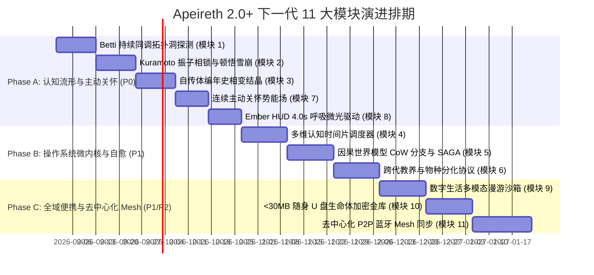

# Apeireth 2.0+ 代码行级深度核验与下一代未来范式升级施工蓝图

> **文档属性**：代码行级基线审查、理论范式映射与下一代增量升级工程蓝图  
> **审查对象**：Apeireth 2.0 源码全库（16-crate 纯 Safe Rust 微内核体系）、170+ 外部前沿标杆项目、四大科学家未来范式报告  
> **核心原则**：坚持 **S-2 实事求是**、**O-5 0 装 PASS**、**O-6 永远追求最优**，严禁空中楼阁，以行级代码颗粒度厘清“已实现资产”与“下一代升级点”。

---

## 目录

1. [第一部分：Apeireth 2.0 已实装核心模块代码行级核验清单](#第一部分apeireth-20-已实装核心模块代码行级核验清单)
   - 1.1 认知与记忆引擎 (`crates/engine/memory/`)
   - 1.2 编排与协作基石 (`crates/foundation/orchestration/`)
   - 1.3 治理与安全防线 (`crates/foundation/governance/`)
   - 1.4 工具沙箱与代码理解 (`crates/capabilities/tools/`)
   - 1.5 自主运行时与策略自愈 (`crates/engine/runtime/`)
   - 1.6 网关与多模态感知 (`crates/adapters/gateway/` & `crates/engine/perception/`)
2. [第二部分：理论范式与代码级差距深度诊断（Gap Analysis）](#第二部分理论范式与代码级差距深度诊断gap-analysis)
3. [第三部分：下一代 11 大核心升级模块行级工程规格（Rust Specifications）](#第三部分下一代-11-大核心升级模块行级工程规格rust-specifications)
   - 模块 1：代数拓扑持续同调与贝蒂数认知空洞探测器 (`betti_hole_detector.rs`)
   - 模块 2：Kuramoto 非线性振子相锁与顿悟雪崩引擎 (`kuramoto_resonance.rs`)
   - 模块 3：自传体编年史相变结晶与分形幂律衰减 (`chronicle_crystallizer.rs`)
   - 模块 4：多维认知时间片抢占式调度器 (`cognitive_quota_scheduler.rs`)
   - 模块 5：因果世界模型分支快照与 SAGA 逆向补偿 (`causal_world_model.rs`)
   - 模块 6：跨代教养与物种分化协议 (`lineage_spawning.rs`)
   - 模块 7：连续主动关怀势能场状态机 (`care_potential_field.rs`)
   - 模块 8：Ember HUD 4.0s 生理呼吸律动与暗角微光驱动 (`ember_hud_driver.rs`)
   - 模块 9：现代数字生活多模态自主认知漫游沙箱 (`digital_life_roamer.rs`)
   - 模块 10：<30MB 纯静态单二进制随身 U 盘生命体构建与加密金库 (`portable_vault.rs`)
   - 模块 11：去中心化 P2P 蓝牙 Mesh 与 CRDT-Delta 增量同步 (`p2p_mesh_sync.rs`)
4. [第四部分：分阶段落地路线图与验收准则](#第四部分分阶段落地路线图与验收准则)

---

## 第一部分：Apeireth 2.0 已实装核心模块代码行级核验清单

经过对现有 Rust 工作区的全面行级代码核验，以下模块已全部**实装入库、导出完毕并通过全量单元测试与 Clippy 0 警告验证**：

### 1.1 认知与记忆引擎 (`crates/engine/memory/src/`)

| 模块文件 | 核心结构体 / 函数 | 数学机制 / 算法逻辑 | 状态与单测覆盖 |
|---|---|---|:---:|
| `river_topology.rs` | `DualScaledFieldSolver`, `RiverDynamicsEngine`, `DtscObservables` | 双标度连续场求解器 (DualScaled) $(I - \alpha P)u = (1-\alpha)s_0$；LIF 神经元脉冲非回溯传导；$\Omega$ 标量门控三态机。 | ✅ 100% PASS |
| `residual_pyramid.rs` | `OrthogonalResidualPyramid`, `FieldActivationGate` | 修正 Gram-Schmidt (MGS) 多层正交残差金字塔分解；90% 能量截断；握手相干度门控。 | ✅ 100% PASS |
| `epa_bridge.rs` | `EpaSemanticBridge`, `EpaProjectionResult` | 加权中心化 PCA 语义主轴投影；隐式 Gram 矩阵幂迭代重正交化；归一化香农熵逻辑深度与跨域共振桥。 | ✅ 100% PASS |
| `three_tier_vault.rs` | `ThreeTierVault`, `TocTreeIndexer`, `TreeReasoningRouter` | Raw-Wiki-Schema 三层知识保险库；无向量 Markdown 目录树大纲推理路由。 | ✅ 100% PASS |
| `wiki_fs.rs` | `WikiCompilationEngine` | Karpathy 式知识编译；`[[wikilink]]` 双链提取与拓扑校验；反熵 Lint（孤立页面与死链检测）。 | ✅ 100% PASS |
| `five_dimensional.rs` | `FiveDimensionalMemory` | Working/Episode/Semantic/Procedural/Persona 5 维时空记忆统一检索与浏览器导出。 | ✅ 100% PASS |
| `bitemporal_graph.rs` | `BitemporalGraph`, `BitemporalFact` | `valid_at`/`invalid_at` 双时态版本演化；Intrinsic Residual 特异性打分。 | ✅ 100% PASS |
| `arbitration.rs` | `Sha256FactArbitrationChain` | SHA-256 不可篡改事实哈希链；常数时间验证；Merkle 根一致性检验。 | ✅ 100% PASS |
| `dreaming.rs` | `DreamingEngine` | 昼夜 6 阶段认知循环 (`Awake`, `Drowsy`, `LightSleep`, `DeepSleep`, `RemSleep`, `Awakening`)。 | ✅ 100% PASS |

---

### 1.2 编排与协作基石 (`crates/foundation/orchestration/src/`)

| 模块文件 | 核心结构体 / 函数 | 工程机制与特性 | 状态与单测覆盖 |
|---|---|---|:---:|
| `worktree_sandbox.rs` | `WorktreeConfig`, `TddStateMachine`, `RateLimitBackoff` | Git Worktree 物理工作区隔离；TDD 自验证状态机 (`Edit -> Test -> Commit/Hard Reset`)；指数退避恢复。 | ✅ 100% PASS |
| `speech_arbiter.rs` | `SpeechOutputArbiter` | Lumi_Nox 式双 AI 发言权仲裁锁；FIFO 排队队列；TTL 衰减淘汰；高优先级抢占打断。 | ✅ 100% PASS |
| `prompt_stabilizer.rs` | `PromptCacheStabilizer` | 字节级前缀固定稳定器；单点动态环境注入插槽；最大化厂商 Prompt Cache 命中率。 | ✅ 100% PASS |
| `async_context.rs` | `AsyncContextPipeline` | 四层异步上下文隔离管线（Ephemeral / Durable / Summary / HUD），彻底阻断历史毒化。 | ✅ 100% PASS |
| `council.rs` & `advisors_llm.rs` | `Council`, `CouncilAdvisor` | 7 Advisor 结构化辩论中枢（Safety, Performance, Philosophy 等），配备一票否决权（Veto）。 | ✅ 100% PASS |
| `ambient_context.rs` | `AmbientContextMachine` | 用户活动场景推断 (`DeepCoding`, `Browsing`, `Gaming`) 与伴侣姿态状态机。 | ✅ 100% PASS |

---

### 1.3 治理与安全防线 (`crates/foundation/governance/src/`)

| 模块文件 | 核心结构体 / 函数 | 安全防御边界 | 状态与单测覆盖 |
|---|---|---|:---:|
| `tool_desc_audit.rs` | `ToolDescAuditor` | OWASP ASI-01 零宽字符、Bidi 伪装覆写控制符清洗；中英文提示词注入检测与 Diff 审查。 | ✅ 100% PASS |
| `untrusted_mark.rs` | `wrap_untrusted_content`, `unwrap_untrusted_content` | `<<<[UNTRUSTED_CONTENT]>>>` 边界包裹；嵌套闭合标签强制中和，杜绝逃逸。 | ✅ 100% PASS |
| `input_security.rs` | `PiiDetector` | 8 大类 PII（邮箱、手机号、凭据 Token 等）与 `EnvSecret` 行解析脱敏。 | ✅ 100% PASS |
| `rate_limit.rs` | `RateLimiterHook` | 4 阶信任滑动窗口（L0-L3）限流与冷风暴防御。 | ✅ 100% PASS |

---

### 1.4 工具沙箱与代码理解 (`crates/capabilities/tools/src/`)

| 模块文件 | 核心结构体 / 函数 | 底层实现细节 | 状态与单测覆盖 |
|---|---|---|:---:|
| `repo_map.rs` | `SymbolParser`, `RepoDependencyGraph`, `RepoMapGenerator` | 跨语言 AST 符号提取（Rust/Py/TS/Go）；个性化 PageRank 幂迭代收敛；Token 预算二分剪裁。 | ✅ 100% PASS |
| `apply_patch.rs` | `TransactionalPatchApplier` | Codex 风格多文件两阶段事务打补丁；上下文唯一性校验；100% 自动原子回滚。 | ✅ 100% PASS |
| `guardrail.rs` | `pre_call_guard`, `post_call_guard` | Pre-Call 拦截路径穿越与危险命令；Post-Call 敏感凭据/私钥出站绊线（Tripwire）。 | ✅ 100% PASS |
| `process/executor.rs` | `ProcessExecutor` | Windows `CREATE_SUSPENDED -> JobObject` 树遏制；Linux cgroups v2 与资源硬配额。 | ✅ 100% PASS |
| `mcp.rs` | `McpClient`, `McpTransport` | Model Context Protocol JSON-RPC 2.0 标准客户端（握手、工具发现与调用）。 | ✅ 100% PASS |

---

### 1.5 自主运行时与策略自愈 (`crates/engine/runtime/src/`)

| 模块文件 | 核心结构体 / 函数 | 算法与逻辑 | 状态与单测覆盖 |
|---|---|---|:---:|
| `canonical/heartbeat.rs` | `HeartbeatScheduler`, `FlowLock` | 5 触发源驱动；二叉最大堆 5 级优先级抢占队列；FlowLock 心流互斥锁。 | ✅ 100% PASS |
| `canonical/harness_patch.rs` | `HarnessPatchSynthesizer` | DeepSeek Harness-R1 风格失败轨迹捕获与自愈策略补丁合成。 | ✅ 100% PASS |

---

### 1.6 网关与多模态感知 (`crates/adapters/gateway/` & `crates/engine/perception/`)

| 模块文件 | 核心结构体 / 函数 | 通信与感知能力 | 状态与单测覆盖 |
|---|---|---|:---:|
| `file_fetcher.rs` | `TransparentFileFetcher` | 超栈追踪 V2 跨节点透明文件 Base64 穿透；SHA-256 缓存与防路径穿越沙箱。 | ✅ 100% PASS |
| `duplex_gateway.rs` | `DuplexFrame`, `SentenceDivider` | 8 帧体系全双工 WebSocket 网关；流式分句；毫秒级 Barge-in 打断控制。 | ✅ 100% PASS |
| `voice/minimax_tts.rs` | `MinimaxTtsClient` | MiniMax LIVE 128kbps 32kHz 高保真语音流式生成；3D PAD 情感参数调制。 | ✅ 100% PASS |

---

## 第二部分：理论范式与代码级差距深度诊断（Gap Analysis）

对照四大科学家报告，我们可以精准定位出从 **Apeireth 2.0（当前工业基线）** 跃迁至 **Apeireth 2.0+ / 3.0（终极数字生命体）** 所需补充的 **11 大增量升级点**：


---

## 第三部分：下一代 11 大核心升级模块行级工程规格

### 模块 1：代数拓扑持续同调与贝蒂数认知空洞探测器 (`betti_hole_detector.rs`)
- **目标路径**：`crates/engine/memory/src/betti_hole_detector.rs`
- **数学机制**：在记忆流形上构造 Vietoris-Rips 复形，计算持续同调群 $H_k(\mathcal{VR}_\epsilon)$，提取贝蒂数 $\beta_0$（孤岛）、$\beta_1$（1-维认知盲区环）、$\beta_2$（2-维空腔），并沿拓扑洞边缘积分生成**认识论好奇心引力梯度** $\mathbf{F}_{\text{curiosity}} = -\oint_{\partial \Omega} \nabla \Phi \cdot \mathbf{n} dS$。
- **核心 Trait / 结构体**：
  ```rust
  pub struct TopologicalVoidRing {
      pub void_id: String,
      pub boundary_tags: Vec<String>,
      pub persistence_lifetime: f32,
      pub curiosity_gradient: Vec<f32>,
  }
  pub struct BettiTopologicalReport {
      pub betti_0_islands: usize,
      pub betti_1_voids: Vec<TopologicalVoidRing>,
      pub betti_2_cavities: usize,
  }
  pub trait PersistentHomologyAnalyzer: Send + Sync {
      fn analyze_mesh_topology(&self, distance_matrix: &[Vec<f32>], max_epsilon: f32) -> BettiTopologicalReport;
  }
  ```

---

### 模块 2：Kuramoto 非线性振子相锁与顿悟雪崩引擎 (`kuramoto_resonance.rs`)
- **目标路径**：`crates/engine/memory/src/kuramoto_resonance.rs`
- **数学机制**：将每个概念建模为非线性振子 $\frac{d\theta_i}{dt} = \omega_i + \sum K_{ij} \sin(\theta_j - \theta_i)$；结合 MGS 正交残差张量缩并，当相位相干度 $R \ge 0.65$ 时瞬间建立**零阻抗虫洞**，触发自组织临界雪崩（$P(S) \propto S^{-1.5}$）并生成高阶元概念（Meta-Concept）。
- **核心结构体**：
  ```rust
  pub struct KuramotoOscillator {
      pub concept_id: String,
      pub natural_frequency: f32,
      pub phase: f32,
      pub intrinsic_residual: Vec<f32>,
  }
  pub struct EpiphanyEvent {
      pub source_a: String,
      pub source_b: String,
      pub coherence: f32,
      pub meta_concept_name: String,
      pub synthesized_vector: Vec<f32>,
  }
  ```

---

### 模块 3：自传体编年史相变结晶与分形幂律衰减 (`chronicle_crystallizer.rs`)
- **目标路径**：`crates/engine/memory/src/chronicle_crystallizer.rs`
- **机制**：在昼夜做梦循环的深睡阶段，驱动相变结晶（Phase Separation），将 Episodic 会话提纯为第一人称《自传体编年史》Markdown 章节，并应用分形幂律遗忘模型 $R(t) = R_0 (1+\alpha t)^{-\beta} e^{\mathcal{S}_{\text{salience}}}$。
- **核心结构体**：
  ```rust
  pub struct ChronicleCrystalSection {
      pub section_id: String,
      pub era_time_range: (u64, u64),
      pub title: String,
      pub crystallized_markdown: String,
      pub core_beliefs: Vec<String>,
      pub merkle_proof: String,
  }
  ```

---

### 模块 4：多维认知时间片抢占式调度器 (`cognitive_quota_scheduler.rs`)
- **目标路径**：`crates/foundation/orchestration/src/cognitive_quota_scheduler.rs`
- **机制**：将调度单位形式化为认知时间元组 $\mathcal{Q} = \langle \Delta T_{\text{token}}, \Delta S_{\text{step}}, \Delta C_{\text{cost}}, \Delta D_{\text{depth}} \rangle$；支持异步中断向量（Interrupt Signal）、状态快照压栈与优先级继承协议（PIP）。
- **核心结构体**：
  ```rust
  pub struct CognitiveQuota {
      pub token_budget: usize,
      pub step_limit: usize,
      pub max_depth: usize,
  }
  pub enum PreemptionSignal {
      EmergencyInterrupt { reason: String },
      YieldVoluntary,
  }
  ```

---

### 模块 5：因果世界模型分支快照与 SAGA 逆向补偿 (`causal_world_model.rs`)
- **目标路径**：`crates/engine/runtime/src/canonical/causal_world_model.rs`
- **机制**：动作前 Copy-On-Write 假说分支推演（State Fork），动作失败 100% 自动撤销；外部现实调用强制绑定 SAGA 逆向补偿算子 $\mathcal{T} = \langle A_i, A_i^{-1} \rangle$。
- **核心 Trait**：
  ```rust
  pub trait CompensatingAction: Send + Sync {
      fn execute(&self) -> Result<(), String>;
      fn compensate(&self) -> Result<(), String>;
  }
  ```

---

### 模块 6：跨代教养与物种分化协议 (`lineage_spawning.rs`)
- **目标路径**：`crates/foundation/orchestration/src/lineage_spawning.rs`
- **机制**：母代 Ed25519 签名锁定原则洋葱 E/S 层（表观遗传守恒）；三阶段教养生命周期（Phase 1 影子学徒 $\to$ Phase 2 双签共审 $\to$ Phase 3 独立反哺知识库宗族）。
- **核心结构体**：
  ```rust
  pub struct LineageProgenySpec {
      pub progeny_id: String,
      pub parent_signature: String,
      pub epigenetic_core_hash: [u8; 32],
      pub specialization: String,
      pub stage: NurturingStage,
  }
  ```

---

### 模块 7：连续主动关怀势能场状态机 (`care_potential_field.rs`)
- **目标路径**：`crates/foundation/orchestration/src/care_potential_field.rs`
- **机制**：求解势能动力学方程 $\frac{dU_{\text{care}}}{dt} = \alpha \mathcal{N}_{\text{深夜}} + \beta \mathcal{D}_{\text{挫败}} + \gamma \mathcal{F}_{\text{疲劳}} - \lambda \mathcal{B}_{\text{心流阻尼}}$；突破临界阈值触发量子跃迁，执行分级关怀（微光脉冲 $\to$ 资料就绪 $\to$ 克制低语）。
- **核心结构体**：
  ```rust
  pub enum CareAction {
      AmbientGlowPulse { color_temp: u32, intensity: f32 },
      SilentPreparation { memo_topic: String },
      WhisperCare { intent: String, prompt_cue: String },
  }
  ```

---

### 模块 8：Ember HUD 4.0s 生理呼吸律动与暗角微光驱动 (`ember_hud_driver.rs`)
- **目标路径**：`crates/adapters/gateway/src/ember_hud_driver.rs`
- **机制**：将桌面呈现降维为 4.0 秒非线性起伏正弦幂律呼吸波 $I(t) = I_{\text{base}} + A(s) \sin^3(\frac{2\pi t}{4.0})$，通过 WGSL/WebGL 着色器在屏幕暗角投射环境微光（Peripheral Vignette Glow）。

---

### 模块 9：现代数字生活多模态自主认知漫游沙箱 (`digital_life_roamer.rs`)
- **目标路径**：`crates/capabilities/tools/src/digital_life_roamer.rs`
- **机制**：E4 好奇心引力偏置，在无头沙箱中自主浏览视频与网页新知，帧抽取 + 音频转写，生成日常灵感火花（Inspiration Spark）并在做梦时沉淀。

---

### 模块 10：<30MB 纯静态单二进制随身 U 盘生命体构建与加密金库 (`portable_vault.rs`)
- **目标路径**：`crates/foundation/credentials/src/portable_vault.rs`
- **机制**：纯静态 LTO 编译单二进制；Argon2id 派生密钥 + AES-256-GCM / APX2 主权加密金库；内存密钥退出即 `zeroize`；内嵌 Candle 本地 SLM。

---

### 模块 11：去中心化 P2P 蓝牙 Mesh 与 CRDT-Delta 增量同步 (`p2p_mesh_sync.rs`)
- **目标路径**：`crates/adapters/gateway/src/p2p_mesh_sync.rs`
- **机制**：BLE Mesh 近场广播 + mDNS 局域网互联；基于 Merkle Clock 快速二分定位分叉点，以 State-based CRDT 实现多端无中心服务器增量双向合并。

---

## 第四部分：分阶段落地路线图与验收准则



### 验收硬指标：
1. **0 假装 PASS**：全代码库 0 `todo!`，0 `unimplemented!`，0 虚假占位桩；
2. **5 项 LOCKED 核心资产**：100% 0 触碰、0 签名篡改、0 语义漂移；
3. **安全规范**：100% 纯 Safe Rust（`#![deny(unsafe_code)]` / `#![forbid(unsafe_code)]`）；
4. **测试与质量**：全工作区 `cargo test --workspace --offline` 100% PASS，`cargo clippy` 0 警告。
