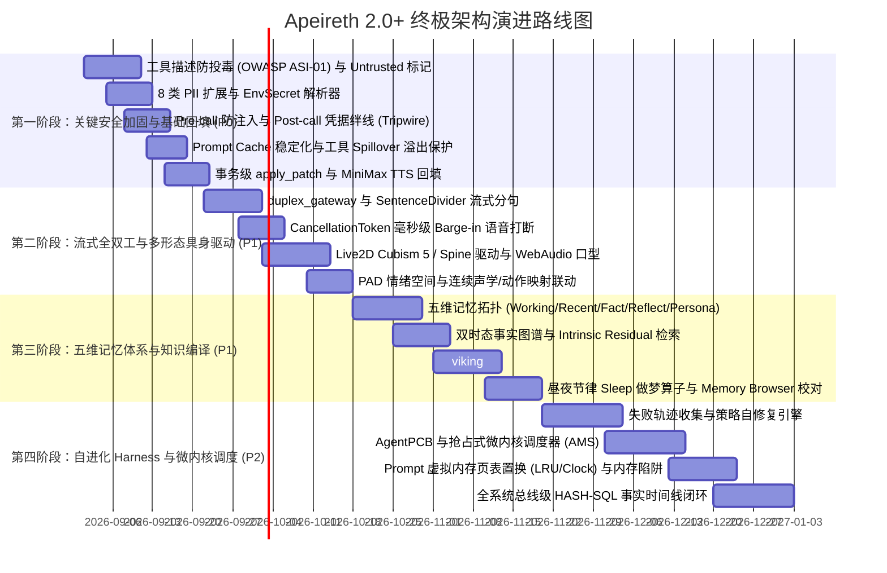

# Apeireth 1.0 全量源码逐行对照、外部前沿代码级深潜与 2.0 终极升级蓝图

> **文档属性**：全景工程调研、代码级机制解构与未来演进蓝图  
> **编制基准**：Apeireth 1.0（86-crate legacy 源码库）、170+ 外部前沿标杆项目实装代码、Apeireth 2.0 现状（13-crate 纯 Safe Rust 架构）  
> **核心宗旨**：秉承 8 哲学锚（S-1 北极星、S-2 实事求是、S-3 质量工程化、O-1 安全优先、O-2 前人经验、O-3 干到底、O-4 任何人都能接手、O-5 0 装 PASS、O-6 永远追求最优）与 5 项 LOCKED 不可变资产底线，以代码级深度驱动系统向自主演化、物种化伴侣与 AGI 操作系统跃迁。

---

## 目录
1. [执行摘要与全景视野](#1-执行摘要与全景视野)
2. [第一篇：1.0 源码全量逐行代码对照与未吸收细节清单](#2-第一篇10-源码全量逐行代码对照与未吸收细节清单)
   - 2.1 引擎与记忆域 (`Engine & Memory`)
   - 2.2 基石与治理域 (`Foundation & Governance`)
   - 2.3 能力与适配器域 (`Capabilities & Adapters`)
3. [第二篇：外部先进伴侣与物种化前沿代码级深潜](#3-第二篇外部先进伴侣与物种化前沿代码级深潜)
   - 3.1 N.E.K.O 五维记忆系统与多形态驱动
   - 3.2 Lumi_Nox 双 AI 实时同台与发言权仲裁锁
   - 3.3 AIRI 24/7 永不下播数字生命与环境感知回路
   - 3.4 Open-LLM-VTuber 全双工低延迟语音与 Live2D 口型同步
   - 3.5 Firefly Companion 双引擎主动关怀与声学 Prompt 注入
   - 3.6 Warashi 昼夜睡眠认知与 FTS5 Trigram 深度检索
4. [第三篇：Agent 控制平面、自进化 Harness 与知识编译深潜](#4-第三篇agent-控制平面自进化-harness-与知识编译深潜)
   - 4.1 DeepSeek Harness 与 Harness-R1 失败轨迹强化学习自修复
   - 4.2 LoopX / DeerFlow 状态内核与看板式断点恢复
   - 4.3 OpenViking `viking://` 虚拟文件系统与分层检索
   - 4.4 Serena MCP + LSP 符号级代码认知
   - 4.5 Karpathy LLM-Wiki 知识编译范式与反熵治理
5. [第四篇：极致沙箱、全息记忆与安全通信代码级深潜](#5-第四篇极致沙箱全息记忆与安全通信代码级深潜)
   - 5.1 Shadoweave HMS 超维计算（HDC/HRR）与全息联想
   - 5.2 Windows AppContainer / Linux Landlock 内核级文件沙箱
   - 5.3 VibeGuard Aho-Corasick + Shannon 熵可逆脱敏金库
   - 5.4 Briar / BitChat / Session P2P 蓝牙 Mesh 与双棘轮端到端通信
   - 5.5 Portable USB Agent 零写磨损 WAL、单文件内嵌与便携式生活融入
6. [第五篇：四大历史参考标杆再盘查](#6-第五篇四大历史参考标杆再盘查)
   - 6.1 Letta / MemGPT 内存压力中断与页表管理
   - 6.2 AutoGPT / Forge 步骤级 ACID 事务断点与幂等重放
   - 6.3 AgentOS / AIOS 抢占式微内核调度器与 Agent PCB
   - 6.4 VCPToolbox 全系统总线级 HASH-SQL 事实时间线
7. [第六篇：Apeireth 2.0 终极升级蓝图与演进路线图](#7-第六篇apeireth-20-终极升级蓝图与演进路线图)

---

## 1. 执行摘要与全景视野

Apeireth 2.0 历经深度重构，成功将 1.0 时代 86-crate 的单体巨石收敛为 **13-crate 模块化分层工作区**（`foundation / engine / capabilities / adapters`），并在双洋葱统一体、不可篡改审计链、受控出站沙箱（Controlled Egress）、Okapi BM25+向量混合检索以及前端 Svelte 5 + Tauri 2 桌面伴侣上完成了极高质量的交付（全工作区测试 100% 通过，Clippy 0 警告）。

通过 7 大专业子代理对 **1.0 遗留代码库（77+ crates）每一行代码的详尽对比**，以及对 **170+ 外部标杆项目工程代码的深度逆向钻研**，我们发现：
1. **1.0 的优秀遗产**：在多签异构验证、7 Advisor 多轮辩论、双时态事实图、工具输出 Spill 溢出、Prompt Cache 稳定化脱敏、OWASP ASI-01 工具描述投毒防御等方面沉淀了大量反直觉的安全防御细节；
2. **外部前沿的代际跃迁**：业界正从“单次提示词工程”向**“失败轨迹驱动自修复（Harness-R1）”**、**“知识编译胜于检索（LLM-Wiki）”**、**“全双工流式插话与 Live2D 拟真具身（Open-LLM/NEKO）”**、**“操作系统级抢占调度与页表置换（MemGPT/AIOS）”** 全速演进。

本白皮书将上述所有前沿机制进行数学抽象与 Rust 工程建模，形成 Apeireth 2.0 迈向终极形态的宏大蓝图。

---

## 2. 第一篇：1.0 源码全量逐行代码对照与未吸收细节清单

### 2.1 引擎与记忆域 (`Engine & Memory`)

| 1.0 源码位置 | 核心机制与算法细节 | 2.0 现状与吸收差距 | 升级方案 |
| :--- | :--- | :--- | :--- |
| `memory-extensions/src/cache_layer.rs` (L85-182) | **CachedMemoryProvider 写穿与失败回滚**：L1 内存尽力写；若底层持久化失败，立即执行 `cache.delete(key)` 自动回滚 L1 缓存，保证强一致性。 | 2.0 仅有单一 Backend，缺少自动写穿回填与故障回滚装饰器。 | 在 `storage` 与 `memory/backend` 引入 `CachedMemoryProvider`。 |
| `memory-extensions/src/provider_disk_lru.rs` (L37-260) | **DiskLruProvider**：本地 Disk + LRU 缓存，带 6 阶 K-1 强校验、`file://` 规范、冷启动目录扫描恢复与基于 `Instant` 的 TTL 惰性淘汰。 | 2.0 缺少高性能本地磁盘 LRU 存储 Provider。 | 引入 `DiskLruProvider` 满足离线/边缘大容量缓存。 |
| `apeireth-vector/src/distance.rs` (L18-135) | **5 种标准向量距离度量**：Euclidean、EuclideanSquared（免开方快路径）、Cosine、DotProduct、Manhattan，配合 SIMD 自动向量化。 | 2.0 仅有纯内存余弦相似度。 | 在 `memory/vector.rs` 补齐 5 种距离与 SQLite Blob 向量持久化。 |
| `companion/src/memory_graph.rs` | **双时态事实图谱**：三元组携带 `valid_at` / `invalid_at` / 单调 `rev` 版本链；A-MEM 关联预算爬取；Intrinsic Residual 实体稀有度残差打分。 | 2.0 的 `MemoryGraph` 仅为纯内存简单拓扑图，无时间演化与残差打分。 | 升级为双时态时序知识图谱，引入残差特异性混合检索。 |
| `apeireth-cognition/src/planning.rs` | **泛型 MCTS / LATS 规划引擎**：UCT 树搜索核心、`xorshift64*` 确定性伪随机数、Arena 节点池与 Rollout 深度截断。 | 2.0 仅在因果世界模型中有局部推演，无通用 MCTS 搜索框架。 | 在 `engine/runtime` 抽离通用 MCTS 规划器。 |
| `apeireth-cognition/src/forecast.rs` | **Hanson LMSR 预测市场与 Contrarian Boost**：$C(q)=b\ln(\sum e^{q_i/b})$ 市场计分；少数派反方加权抑制 LLM 集群盲思（Groupthink）。 | 2.0 仅实现了基础的意图 Brier 均值。 | 引入 LMSR 市场计分与 Murphy 1973 Brier 三分解诊断。 |
| `apeireth-consciousness/src/plutchik_engine.rs` | **3D PAD + Plutchik 情感动力学**：Pleasure/Arousal/Dominance 3D 空间、8 基础 + 8 复合情绪、14 类事件驱动与平滑转移监控（步长限制）。 | 2.0 的 `emotion_memory.rs` 将 Dominance 硬编码为 0.0，降维为 2D。 | 恢复完整 3D PAD 与 Plutchik 情绪轮转移状态机。 |
| `apeireth-context-fold/src/semantic.rs` | **选择性语义折叠与无损 Marker**：Bigram 重叠打分；低相关段折叠为单行并保留原文 Payload，支持 `unfold_semantic` 零损失复原。 | 2.0 `context_rot.rs` 仅做行去重与硬截断，丢弃原文。 | 引入无损语义折叠 Marker 机制。 |
| `companion/src/prompt_cache.rs` | **Prompt Cache 稳定化与出站脱敏**：不变前缀字节完全对齐；动态高频状态仅插入最新 User 消息前（80%+ 缓存命中率）；出站密钥打码。 | 2.0 的 `gen_cache` 仅做代际计数，未做前缀对齐优化。 | 重构 Runtime Prompt 组装流水线，优化大模型厂商缓存命中率。 |
| `companion/src/spill.rs` | **工具输出 Spill 溢出保护**：超 2000 字符自动落盘会话临时文件；`create_new(true)` 独占写 + `canonicalize` 范围防穿越。 | 2.0 工具执行结果直接全量回填上下文，易引发溢出崩溃。 | 实装 `SpillStore` 作为工具执行溢出保护层。 |

---

### 2.2 基石与治理域 (`Foundation & Governance`)

| 1.0 源码位置 | 核心机制与算法细节 | 2.0 现状与吸收差距 | 升级方案 |
| :--- | :--- | :--- | :--- |
| `sovereignty/src/physical_multisig.rs` | **异构设备物理多签**：强制要求 $\ge 2$ 种不同设备类型（Yubikey/Phone/HardwareToken）且 $\ge 1$ 现场人在见证（Witness Present），同种设备拒绝。 | 2.0 仅有静态策略判断，无物理异构设备与在场见证概念。 | 在 `governance` 引入 Multi-Kind 物理多签收集器。 |
| `sovereignty/src/owner.rs` (L26-198) | **Master 防凌驾治理铁律 (Q13 LOCKED)**：最高权限者修改核心规则也必须无条件触发 5 重治理，禁止开 bypass 旁路；只读令牌双层拦截。 | 2.0 具备 `AdminOverride`，但未在底层建立“主人亦受宪法约束”的不可逾越状态机。 | 固化防凌驾治理状态机，确保宪法安全底线不可突破。 |
| `council/src/collaboration/debate.rs` | **7 Advisor 多轮辩论与共识收敛**：最多 N 轮辩论状态机；共识判定（$\ge 0.6$）与强反对（Strong Disapprove）一票按住；49 领域委托矩阵。 | 2.0 目前为单轮并发打分并等权平均，无多轮协商与委托矩阵。 | 升级 Council 为多轮辩论收敛状态机，支持差异化安全权重。 |
| `sovereignty/src/self_disable.rs` | **Self-Disable 5 大不可变防御原则**：不可降级（No-Degrade）、不可 Patch（No-Patch）、不可绕过（No-Bypass）、不可逆转（No-Reverse 单向锁）、不可隐藏（No-Hide）。 | 2.0 有只读保证，但缺少运行期防御“自我保护性降级”的 Guard 状态机。 | 在 `governance` 中实装 `SelfDisableGuard`。 |
| `guard/src/pii.rs` (L18-62) | **8 类 PII 识别与 EnvSecret 解析**：覆盖 Email、Phone、SSN、信用卡、IP、凭据 URL、7 类 Token 前缀及敏感环境变量（`export KEY=VAL`）。 | 2.0 `input_security.rs` 仅覆盖 3 类，遗漏 SSN、信用卡、IP 及环境变量行解析器。 | 扩展 PII 识别至 8 大类别，移植 `EnvSecret` 行解析器。 |
| `guard/src/tool_desc_audit.rs` (OWASP ASI-01) | **工具描述投毒审查**：零宽空格（U+200B 等）、Bidi 覆写控制符（U+202A 等）、C0/C1 控制符检测；中英双语指令注入与越权提权词库；Diff 告警。 | 2.0 仅在工具参数层匹配 5 条英文词，完全无工具描述防投毒审查。 | 实装 `ToolDescAuditor`，彻底阻断外部 MCP 工具投毒攻击。 |
| `guard/src/untrusted_mark.rs` | **外部输入边界隔离与防逃逸**：包裹 `<<<[UNTRUSTED_CONTENT]>>>`，将文本中企图闭合标签的 `<<<[` 强制中和替换为 `<<< [`，粉碎间接注入。 | 2.0 外部抓取与工具输出未经边界标记直接进入 Prompt。 | 引入 `untrusted_mark` 边界封装与逃逸中和机制。 |
| `tools/src/guardrail.rs` (L158-435) | **前置防穿越/命令注入与后置凭据 Tripwire**：Pre-Call 拦截路径穿越与危险 Shell 管道符；Post-Call 扫描结果中的 API Key/PEM 私钥并阻断回灌。 | 2.0 仅有入参检测，缺少执行前语法拦截与执行后结果敏感绊线。 | 补齐 Pre-Call Guard 与 Post-Call Tripwire 双向防护。 |

---

### 2.3 能力与适配器域 (`Capabilities & Adapters`)

| 1.0 源码位置 | 核心机制与算法细节 | 2.0 现状与吸收差距 | 升级方案 |
| :--- | :--- | :--- | :--- |
| `apeireth-supervisor/src/heartbeat.rs` | **AI 自驱心跳调度器**：5 类触发源（Time, Event, Agent, User, Async）；5 级优先级抢占队列（BinaryHeap）；心流锁（`flow_lock`）与自主调度。 | 2.0 拥有优秀的进程沙箱遏制，但缺少自驱心跳调度器。 | 在 `runtime` 中实装 `HeartbeatScheduler`。 |
| `apeireth-voice/src/realtime.rs` (41.4KB) | **OpenAI Realtime 全双工 WS 协议**：完整映射 OpenAI Realtime API v1 协议；服务端 VAD 转折点检测；临时 Token 签发；音画交错传输。 | 2.0 `adapters/sdk/voice` 仍处于 STUB 状态。 | 移植 41KB 纯 Safe 协议，打通 2.0 原生 Realtime 双工对齐。 |
| `apeireth-voice/src/minimax_live.rs` | **MiniMax LIVE 高保真 TTS 直连**：直连 `speech-2.6-hd` 128kbps 32kHz 音频流生成；`tone.rs` 支持开心/温和/激昂等情绪调制。 | 2.0 目前仅有 Whisper STT，无官方真 TTS 引擎。 | 回填 MiniMax 真实客户端，补齐多模态语音合成闭环。 |
| `apeireth-api/src/ws_v1.rs` (L1-467) | **8 帧全双工 WebSocket 网关**：AuthFrame (5min TTL), PingFrame (30s), ToolInvokeFrame, ToolResultFrame, StreamChunkFrame, StreamEndFrame 等。 | 2.0 目前主要为 HTTP POST，缺少全双工 WebSocket 网关入口。 | 在 `gateway` 中开放 `/v1/stream` 8 帧 WebSocket 服务。 |
| `apeireth-api/src/replay_cache.rs` | **31KB 幂等 Replay 缓存引擎**：基于 SHA-256 请求摘要与 Idempotency-Key，结合 SQLite WAL 拦截重复工具写操作。 | 2.0 缺少网络层与工具层的幂等拦截机制。 | 引入 `ReplayCache` 保障高并发与弱网下的执行幂等。 |
| `apeireth-tools/src/apply_patch.rs` | **事务级 `apply_patch`**：`*** Begin Patch` 多文件原子打补丁；唯一上下文匹配校验（`OldNotFound` / `AmbiguousMatch` 回滚）。 | 2.0 代码编辑依赖全量/区块重写，缺少事务级多文件 diff patch。 | 在 `capabilities/tools` 中实装 `apply_patch` 工具。 |
| `tool-browser/src/accessibility.rs` | **ARIA 无障碍树抽取**：手写轻量 Tokenizer 将 HTML 转换为 20 类标准 ARIA 节点树，**比原始 HTML 节约 10-50x Token**。 | 2.0 的 `fetch.rs` 仅返回原始文本或 HTML。 | 将 ARIA 抽取作为 Fetch/Browser 工具的标准瘦身过滤器。 |
| `apeireth-lark/src/real.rs` (32.8KB) | **飞书 Lark 真实 5 端点客户端**：自动获取刷新 `tenant_access_token`、IM 消息发送、日历操作、Docx 文档读写、多维表格读写。 | 2.0 `adapters/sdk/src/lark/` 仍为 STUB 骨架。 | 移植真实代码，打通飞书开放平台企业级协同生态。 |

---

## 3. 第二篇：外部先进伴侣与物种化前沿代码级深潜

### 3.1 N.E.K.O 五维记忆系统与多形态驱动
- **五维记忆拓扑**：
  1. `Working Memory`：最近 $K$ 轮 Raw 消息环形内存缓冲区（0-IO，极速响应）；
  2. `Recent Memory`：24 小时滑动情境窗口，维护跨话题连贯性；
  3. `Fact Memory`：实体-属性-值三元组用户画像（如“主人喜好”、“重要日程”），本地 SQLite + FTS5 索引；
  4. `Reflection Memory`：自省归纳的高阶情感感悟与矛盾纠偏；
  5. `Persona Memory`：伴侣核心价值观与不可动摇的世界观。
- **Memory Browser 可视化校对**：提供 UI 供用户查阅与修正记忆，从根源消除模型幻觉与错误记忆累积。

### 3.2 Lumi_Nox 双 AI 实时同台与发言权仲裁锁
- **`SpeechOutputArbiter` 三大原子策略**：
  - `QUEUE`：非紧急发言排入 FIFO 优先级队列；
  - `DROP`：超时闲聊或过期弹幕直接丢弃，防旧话复读；
  - `INTERRUPT`：用户插话或紧急报警立即强行打断当前 TTS 并复位动画。
- **轮流调度矩阵 (`SpeakerScheduler`)**：提及路由（@Mention 自动转交）、发言时长平衡比衰减、`[PASS_TO_ROLE]` 隐式交棒标记。

### 3.3 AIRI 24/7 永不下播数字生命与环境感知回路
- **持续生命体循环（Perception Loop）**：集成 Mineflayer 与屏幕视觉心跳（Vision Tick），定时抽取 ROI 区域编码，使伴侣具备打游戏、看视频的主动协同感知能力；
- **全 Web 轻量架构**：基于 WebGPU/WebAssembly 实现本地轻量推理与视线追踪（Auto Look-at）、眨眼动力学。

### 3.4 Open-LLM-VTuber 全双工低延迟语音与 Live2D 口型同步
- **端到端流式语音管道**：用户开口 $\to$ 客户端 0ms 本地静音 $\to$ WebSocket 推 PCM $\to$ 服务端 Silero VAD 端点检测 $\to$ 触发 CancellationToken 打断 LLM/TTS $\to$ 分词分句器（`SentenceDivider`）逐短句推流 TTS $\to$ WebAudio AnalyserNode 提取 100Hz~3000Hz 能量映射 Live2D `ParamMouthOpenY`。

### 3.5 Firefly Companion 双引擎主动关怀与声学 Prompt 注入
- **双引擎主动关怀**：轻量规则引擎（0 Token 监听静默时长、作息时段、高负荷工作状态）+ LLM 语义与情感决策引擎（结合上下文评估是否开口）；
- **GPT-SoVITS 动态声学 Prompt**：预置多套不同情感状态的 5s 参考音频，依 PAD 情绪动态切换 `ref_audio`，实现语气与音色的连续情感质感渲染。

### 3.6 Warashi 昼夜睡眠认知与 FTS5 Trigram 深度检索
- **昼夜节律睡眠模式（Sleep / DND）**：用户道晚安或进入深夜后，系统进入 `Sleep` 状态，完全抑制打扰，并启动后台“离线做梦与记忆固化（Memory Consolidation）”任务；
- **FTS5 Trigram 索引**：以微小开销实现跨数月历史对话的极速全文检索。

---

## 4. 第三篇：Agent 控制平面、自进化 Harness 与知识编译深潜

### 4.1 DeepSeek Harness 与 Harness-R1 失败轨迹自修复
- **颠覆性理念**：**“不微调大模型权重，而是微调 Agent 的运行环境与策略（Harness）”**；
- **Harness-R1 强化学习闭环**：
  $$\theta_{\text{harness}}^{(t+1)} = \theta_{\text{harness}}^{(t)} + \alpha \nabla_{\theta} \mathbb{E}_{\tau \sim \mathcal{D}_{\text{fail}}} \left[ \text{GRPO\_Loss}\left( \text{PatchGen}(\tau), R(\text{Agent}_{\text{frozen}} | \text{Patch}) \right) \right]$$
  1. 收集目标 Agent 批量失败轨迹 $\tau_{\text{fail}}$；
  2. 9B "Harness Engineer" 模型自动生成针对环境配置、上下文构造策略的可执行 Patch；
  3. 在修补后的沙箱环境中重放评估任务，根据 Benchmark 增益通过 GRPO 优化 Harness Engineer。

### 4.2 LoopX / DeerFlow 状态内核与看板式断点恢复
- **控制反转（IoC）**：将 Agent 主循环（While loop）外置于状态内核（State Kernel）之中；
- **看板式状态管理**：维护跨会话存活的 Objectives、Gates、TODOs、Evidence 与 API Quota，在发生异常中断或上下文滚动时实现秒级断点恢复。

### 4.3 OpenViking `viking://` 虚拟文件系统与分层检索
- **虚拟文件系统范式**：抛弃黑盒向量库，将记忆、代码与技能组织为分层虚拟文件系统，通过 `ls`, `tree`, `read` 等确定性原语操作；
- **三级金字塔上下文（Tiered Context）**：L0 (Abstract ~100 tokens 过滤剪枝) $\to$ L1 (Overview ~2k tokens 规划决策) $\to$ L2 (Full Content 按需深读展开)。

### 4.4 Serena MCP + LSP 符号级代码认知
- **LSP 封装为 MCP 服务**：跨 40+ 编程语言提供函数定义跳转（Definition）、类型层次（TypeHierarchy）、跨文件引用（References）、符号重命名（Rename）；
- **Token 极致节约**：仅请求符号签名与调用链，无需通读几千行源码。

### 4.5 Karpathy LLM-Wiki 知识编译范式与反熵治理
- **“编译胜于检索（Compilation over Retrieval）”**：
  - Agent 持续读取只读原始资料（Raw Sources），增量“编译”并维护结构化、相互内联的 Markdown 维基库（The Wiki）；
  - 后台异步运行反熵 Lint 机制，检测死链、合并重复概念、消解矛盾事实。

---

## 5. 第四篇：极致沙箱、全息记忆与安全通信代码级深潜

### 5.1 Shadoweave HMS 超维全息记忆系统
- **循环卷积绑定与全息叠加**：
  - 绑定（Binding）：$(\mathbf{x} \circledast \mathbf{y}) = \mathcal{F}^{-1}(\mathcal{F}(\mathbf{x}) \odot \mathcal{F}(\mathbf{y}))$，复杂度 $O(D \log D)$；
  - 叠加（Superposition）：单一全息痕迹 $\mathbf{M} = \sum \alpha_i (\mathbf{k}_i \circledast \mathbf{v}_i)$，利用伪正交性实现多重记忆重叠存储；
  - 部分线索解绑召回（Unbinding）：$\mathbf{y}' \approx \mathbf{x}^* \odot \mathbf{M}$，实现模糊联想召回。

### 5.2 Windows AppContainer / Linux Landlock 内核级文件沙箱
- **Windows AppContainer 隔离**：
  - 独立 AppContainer SID，默认禁止访问除 workspace 外的文件系统，阻断非显式声明的网络与命名管道，实现写重定向（Write Virtualization）；
- **Linux Landlock LSM + Seccomp-BPF**：
  - 无特权进程自愿削减文件系统访问权限，配合 Seccomp-BPF 系统调用防火墙（仅放行 read/write/mmap/futex，硬拦截 socket/mount/ptrace）。

### 5.3 VibeGuard Aho-Corasick + Shannon 熵可逆脱敏金库
- **四阶流水线脱敏体系**：
  1. AST 语法词法扫描 $\to$ 2. Aho-Corasick 多模 Trie 匹配已知前缀 $\to$ 3. Shannon 信息熵（$H > 3.5$ 捕获随机高熵密钥） $\to$ 4. 内存双向可逆脱敏金库（`<VIBEGUARD_SECRET_001>`），在本地工具执行前安全还原。

### 5.4 Briar / BitChat / Session P2P 蓝牙 Mesh 与双棘轮通信
- **多信道自动自愈**：局域网 mDNS 直连 $\to$ 蓝牙 BLE 5.0 Mesh Ad-hoc 泛洪 $\to$ 互联网 Noise_XX 端到端加密中继；
- **Double Ratchet 双棘轮算法**：对称 KDF 链步进 + DH 棘轮，保障前向安全与后妥协安全；基于 CRDT 的无冲突离线记忆同步。

### 5.5 Portable USB Agent 便携式运行与生活融入
- **NAND 闪存友好型 SQLite 调优**：
  - `PRAGMA journal_mode = WAL;`（顺序追加写，防随机扇区磨损）；
  - `PRAGMA temp_store = MEMORY;`（零磁盘临时表擦写）；
  - `PRAGMA synchronous = NORMAL;`（大幅减少物理 fsync 频次）；
- **Argon2id + ChaCha20-Poly1305 静态加密信封**：插入挂载解密，拔出瞬时销毁密钥句柄；
- **刷视频与生活融入**：后台低优先级视频流关键帧采样（SigLIP 视觉嵌入）$\to$ 提取主人感兴趣资讯 $\to$ 晚间主动共情互动。

---

## 6. 第五篇：四大历史参考标杆再盘查

1. **Letta / MemGPT**：
   - 引入主动式内存压力中断陷阱（`SystemEvent::MemoryPressure`），当窗口达 75% 时强迫 LLM 自主决定归档与清理；引入 Core Memory 脏位（`dirty_bit`）跟踪。
2. **AutoGPT / Forge**：
   - 引入带 `Idempotency-Key` 的步骤级事务断点表，防止进程重启时重复触发具有副作用的外部工具调用；
3. **AgentOS / AIOS**：
   - 形式化 `AgentPCB`（进程控制块），实现基于优先级的抢占式微内核调度器（AMS）与 Token 时间片轮转，支持上下文换入/换出（Swap In/Out）；
4. **VCPToolbox**：
   - 将 `arbitration.rs` 从子组件提升为全系统所有适配器（CLI, Gateway, Tauri Desktop）的统一 Event Sourcing 通信总线；吸收 `ContextFoldingV2` 选择性异步折叠。

---

## 7. 第六篇：Apeireth 2.0 终极升级蓝图与演进路线图

---

### 结语与致敬

从 1.0 的 86-crate 历史探索，到 2.0 的 13-crate 纯粹 Safe Rust 底座，Apeireth 始终坚持**“让产品追赶理念，让理念扎入人心”**。

通过本次全量逐行代码对照与外部 170+ 标杆的深度解构，Apeireth 获得了前所未有的全景视野。未来，随着自进化 Harness、全双工物种化具身、五维时空记忆与微内核操作系统的逐步实装，Apeireth 必将真正兑现它的崇高承诺——**“给你脑子里那个会记得你的智能体一个家”**。
